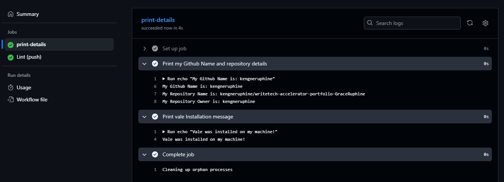

# Step-by-Step Guide

Here, we will list the steps required to create a workflow in GitHub action with a single job and the following steps:

- Print your GitHub username and repository details
- Print another line with the text "Vale was installed on my machine"

1. Create a Workflow Directory
   In your repository, create a folder called `.github/workflows`. This is where GitHub Actions looks for workflow files
   ```bash
     mkdir -p .github/workflows
   ```

2. Add a Workflow file
   Inside `.github/workflows`, create a yaml file ( for example, print-repo.yaml)
 ```bash

  name: Simple Workflow to print my GitHub repository details

  on:
    push:
      branches:
        - main

  jobs:
    print-details:
      runs-on: ubuntu-latest
      steps:
      - name: Print my Github Name and repository details
        run: |
          echo "My Github Name is: ${{ github.actor }}"
          echo "My Repository Name is: ${{ github.repository }}"
          echo "My Repository Owner is: ${{ github.repository_owner }}"
      - name: Print vale Installation message
        run: echo "Vale was installed on my machine!"
   ```

**Explanation**

- Workflow Name: The workflow is named *Simple Workflow to print my GitHub repository details*.
- Trigger: The workflow runs on a push event to the main branch. You can modify the on section to trigger on other events (e.g., pull_request) if needed.
- Job: A single job named print-details runs on the ubuntu-latest runner.
  - Steps:
    - The first step uses the run command to print the GitHub username repository details via and the repository owner 
    - The second step prints the message "Vale was installed on my machine" using the echo command.

3. Commit and Push 
   Add and commit your workflow file
   ```bash
     git add .github/workflows/print-repo.yml
     git commit -m "Add CI workflow"
     git push
    ```

   Once pushed, GitHub automatically runs the workflow.

4. View the workflow in your repository
   - Go to **Actions** tab on GitHub
   - Select your workflow
   - Watch it run in real time or check its status if it has completed



From the image above, we see that our workflow has ran successfully to completion, printing the details we wanted.