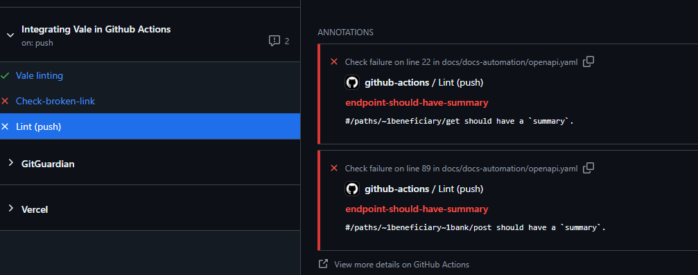
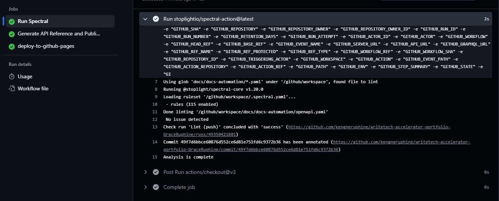

# Automation and Static Site Deployment Project

This project involves configuring **Vale** to automatically run on all Markdown files whenever a commit is made to the main branch. It also sets up an automated workflow that validates OpenAPI 3.0 specs using **Spectral**, generates static API reference docs with Redocly CLI, and publishes them to GitHub Pages.

## What rules/standards were enforced with Vale and Spectral

1. Vale:
   - I used the Google style guide and also created a custom style guide to replace certain words from a predefined list.
   - I integrated a Markdown link check in the GitHub Actions workflow to catch broken links. Below is a screenshot of the workflow failing due to broken links:
        

2. Spectral
   - I added a rule to ensure that each endpoint included a *summary* field. 
     Below is a screenshot of the workflow failing because some endpoints did not have the summary field:
        

   - I generated the static site from the OpenAPI file using Redocly and deployed it on GitHub Pages.
     Below is a screenshot of the workflow showing a successful deployment:
        

    - Here is the link to the static site on [Chimoney Pages](https://kengneruphine.github.io/writetech-accelerator-portfolio-GraceRuphine/)

## Challenges faced

I faced some challenges when deploying to GitHub Pages. One major issue was that Redocly generates a single file when you run the build-docs command, but GitHub Pages deployment only works with a folder of static files. With the help of ChatGPT, I was able to solve this issue. Additionally, following the official [deploy-pages](https://github.com/actions/deploy-pages), documentation helped me resolve other related problems.

## What I Learned

I learned a lot in this assessment from setting up Vale and writing custom style guides to configuring Spectral rules for linting OpenAPI files, and diving deeper into GitHub Actions. This hands-on experience with GitHub Actions has given me the confidence to tackle any problem involving workflow automation and CI/CD pipelines.
